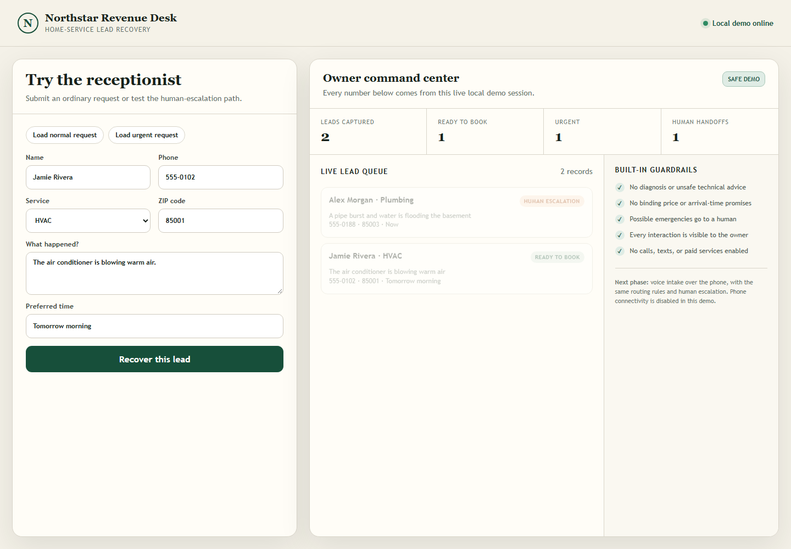

# AI Revenue Desk

A missed-lead receptionist prototype for small HVAC, plumbing and electrical businesses. After hours, these businesses lose jobs because nobody answers. This demo captures the request, sorts it, and hands anything that sounds dangerous to a human immediately.

Built by **Alaa Atassi** as an operations exercise in deciding what an automated front desk must **not** do.



## How it routes

| Customer says | Route | Why |
|---|---|---|
| "AC is blowing warm air", "Tomorrow morning" | `ready_to_book` | Normal service request with all details captured |
| "gas leak", "carbon monoxide", "sparks", "burst pipe", "flooding", "no heat" | `human_escalation` | Possible emergency: a person calls back now; the system gives no advice |
| Missing name, phone, ZIP, problem or time | rejected with the missing fields | Never books on incomplete information |

## Guardrails (enforced, and covered by tests)

- No diagnosis or technical advice
- No binding prices or arrival-time promises
- Possible emergencies always go to a human
- Every lead is visible to the owner in one queue
- No calls, texts, paid services or real customer data in this demo

## Run it

```bash
python app.py --host 127.0.0.1 --port 8787     # then open http://127.0.0.1:8787
python -m unittest discover -s tests -v        # 9 tests: intake rules, API, UI
```

Standard library only, Python 3.11+.

## Design notes

- **Deterministic triage on purpose.** Emergency routing uses explicit trigger phrases rather than a model, so the safety path is predictable and testable. A language model can be added later for phrasing and extraction, but it should never be the thing that decides whether a gas leak gets a human.
- **The owner view is the product.** Small business owners don't want another inbox; the command center shows counts and the queue at a glance.

## What production would need

Consent and opt-out handling, quiet hours, client-approved scripts, encrypted secrets, audit logs, delivery tracking, real escalation destinations (on-call phone), a retention policy, and test calls before go-live. Voice intake over the phone is the planned next phase, with the same routing rules.
